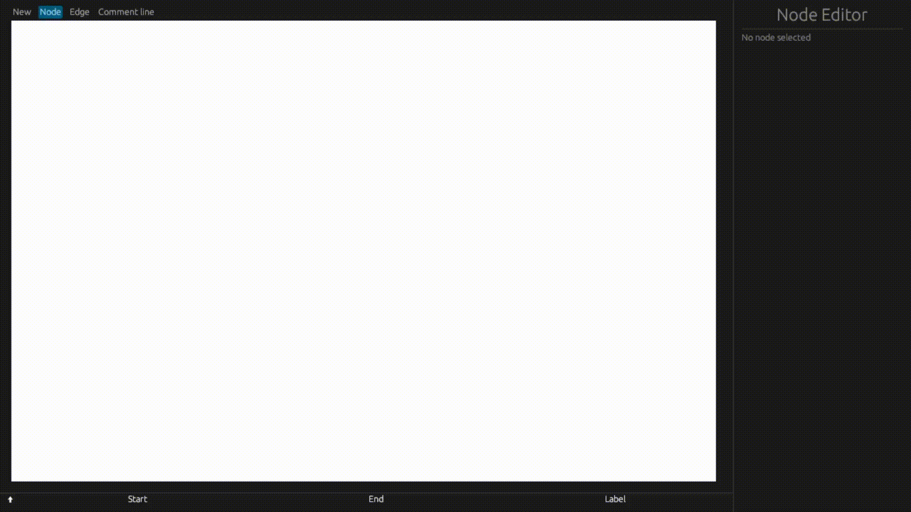
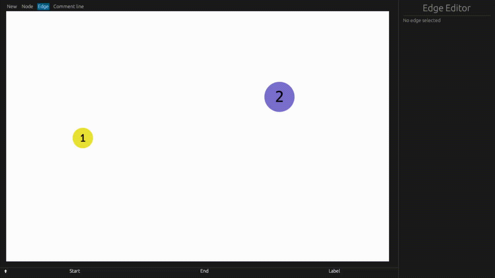
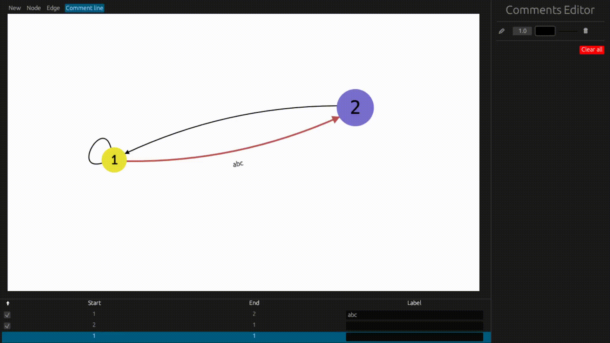

# Graph Editor

Here is simple editor to visualize graph made with `Rust` and [`egui`](https://github.com/emilk/egui).

    

## Abilities

### Support node creation and modification

    

### Support edge multiedging creation and modification (including loop edges)

    

 

### Adding comment lines above graph

    

 

### Labels autorotation

    

 
